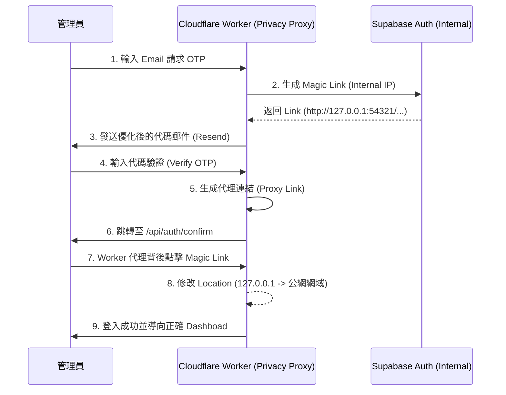

# 🍁 Momiji Select 認證隱私橋接系統 (Auth Privacy Bridge)

本系統是 Momiji Select 核心的安全防護機制，負責在 **完全不公開 Supabase 內部網址 (127.0.0.1)** 的前提下，實現流暢的跨網域認證與防垃圾郵件 (Anti-Spam) 發信流程。

---

## 🏗️ 系統架構 (Architecture)



---

## 🛠️ 開發規範 (Standards)

### 1. 認證流程 (Handler Logic)
在修改 `worker/handlers/auth.ts` 時，必須確保以下邏輯的完整性：

> [!IMPORTANT]
> **隱私代理核心**
> 絕對不可直接將 Supabase 返回的連結回傳給前端。必須將其封裝成：
> `https://api.momiji.qzz.io/api/auth/confirm?q=[Base64_Encoded_Link]`

### 2. 網域自動感應與改寫 (Dynamic Domain Rewriting)
為了支援多個子網域（如 `admin` 與 `www`），橋接器不再使用硬編碼網域，而是動態從原始連結中提取目標：

```typescript
// 解析原始連結中的跳轉目標 (redirect_to)
const linkUrl = new URL(originalLink);
const targetRedirect = linkUrl.searchParams.get('redirect_to');

if (finalLocation.includes('http://127.0.0.1:3000')) {
    // 優先使用原始請求的 Origin 作為替換目標
    const baseTarget = targetRedirect ? new URL(targetRedirect).origin : env.NEXT_PUBLIC_FRONTEND_URL;
    finalLocation = finalLocation.replace('http://127.0.0.1:3000', baseTarget);
}
```

> [!TIP]
> **多網域路由準則**
> 1. `admin.momiji.qzz.io` 登入 ⮕ `redirectTo` 會帶入 admin ⮕ 登入後確保留在 admin。
> 2. `www.momiji.qzz.io` 登入 ⮕ `redirectTo` 會帶入 www ⮕ 登入後確保留在 www。

---

## 📬 郵件發信規範 (Email Strategy)

為了確保 100% 入信率 (Inbox Success)，請嚴格遵守：

| 項目 | 標準設定 | 目的 |
| :--- | :--- | :--- |
| **發信人 (From)** | `noreply@mail.momiji.qzz.io` | 強制網域匹配，獲取 Gmail 信任 |
| **回覆位址 (Reply-to)** | `support@momiji.qzz.io` | 建立信任訊號，避免被判定為 Bot |
| **主旨 (Subject)** | `您的 Momiji 登入驗證碼 (10 分鐘內有效)` | 正常化語氣，降低 Spam 判定 |

> [!TIP]
> **內容優化 (Content-First)**
> 郵件內容必須包含情境文字（如：「我們收到一個登入請求...」），避免純數字/純代碼模式，這能顯著提升 Domain 的發信信譽 (Reputation)。

---

## ⚡ 故障排除與維護 (Troubleshooting)

### 編碼問題 (UTF-8 Corruption)
若在 Next.js 或 Wrangler 編譯時遇到 `Invalid utf-8 sequence`：
1. **禁止** 直接在本地使用 PowerShell 命令修復含中文字串的檔案。
2. **解決方案**：採用 **「備份替換法」**——先以 `write_to_file` 產生 `.fixed` 文件，再用 `Move-Item` 覆蓋。

### Gmail 被攔截 (550 5.7.1)
若信件進垃圾桶或被拒收，請檢查：
- DNS 是否具備 `_dmarc` 紀錄 (`v=DMARC1; p=none;`)。
- 是否誤用了 `onboarding@resend.dev` 作為發信人。

---

## 🔄 同步流程
每次修改認證邏輯後，必須遵循 **[Momiji Update Protocol](file:///e:/Online store/.agents/skills/momiji-update/SKILL.md)**：
1. 代碼編輯 ⮕ 2. 字元檢查 ⮕ 3. 推送至 GitHub `workspace` 分支。
